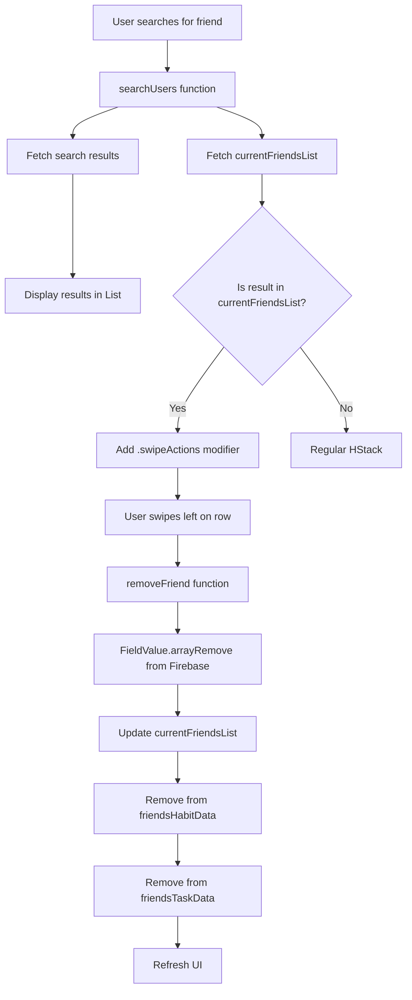

# Friend Deletion Feature Implementation Plan

## Overview

Add swipe-to-delete functionality for friends that already exist in the user's friends list when searching in the AddFriends view. The swipe gesture will use SwiftUI's native `.swipeActions()` modifier (recommended for Lists), and will remove the friend from Firebase backend.

## Current State Analysis

### Files Involved:

- **[Prod1/Friends/AddFriends.swift](Prod1/Friends/AddFriends.swift)**: Currently displays search results in a `List` with `HStack` rows. Tapping a result adds the friend.
- **[Prod1/Friends/FriendsViewModel.swift](Prod1/Friends/FriendsViewModel.swift)**: Contains `addFriends` function that uses `FieldValue.arrayUnion`. No removal function exists yet.
- **[Prod1/Habits/SwipeGeometryReader.swift](Prod1/Habits/SwipeGeometryReader.swift)**: Contains the reusable `SwipeableRow` component (used in HabitTracker, but NOT recommended for Lists - we'll use SwiftUI's native `.swipeActions()` instead).
- **[Prod1/AuthState.swift](Prod1/AuthState.swift)**: Contains friend-related `@Published` properties but no current friends list tracking.

### Key Implementation Details:

- Friends are stored as an array of usernames in the user's Firestore document: `users/{userId}/Friends: [String]`
- `addFriends` function checks if friend exists by reading the `Friends` array
- `SwipeableRow` requires `content`, `onSwipeLeft`, and `onSwipeRight` closures
- Search results are stored in `authState.searchResults` as `[String: Int]` (uniqueKey: progressTime)

## Step-by-Step Implementation

### Step 1: Add current friends list tracking to AuthState

**File**: [Prod1/AuthState.swift](Prod1/AuthState.swift)

Add a new `@Published` property to track the current user's friends list:

- Add `@Published var currentFriendsList: [String] = []` in the FriendsViewModel section (around line 186)
- This will be used to check if a search result is already a friend

**Why**: We need to know which search results are already friends to enable swipe-to-delete only for those entries.

---

### Step 2: Create removeFriend function in FriendsViewModel

**File**: [Prod1/Friends/FriendsViewModel.swift](Prod1/Friends/FriendsViewModel.swift)

Add a new function `removeFriend(withUsername username: String) async` to the `FriendsViewModel` protocol and implement it in the `AuthState` extension:

- Check if user is logged in (get `currentUserId`)
- Get reference to current user's document: `users/{currentUserId}`
- Use `FieldValue.arrayRemove([username])` to remove the username from the `Friends` array
- Update local state on main thread:
  - Remove from `currentFriendsList` (if present)
  - Remove from `friendsHabitData[username]`
  - Remove from `friendsTaskData[username]`
- Call `friendsCounter()` to update the friend count
- Call `fetchAllFriendsData()` to refresh remaining friends' data (optional but ensures consistency)
- Handle errors appropriately with print statements

**Why**: This mirrors the `addFriends` function but removes instead of adds. It updates both Firebase and local state. Note: `fetchAllFriendsData()` will re-fetch all remaining friends, which ensures consistency but may be slightly inefficient.

---

### Step 3: Update friendsCounter to populate currentFriendsList

**File**: [Prod1/Friends/FriendsViewModel.swift](Prod1/Friends/FriendsViewModel.swift)

Modify the `friendsCounter()` function (around line 201) to also populate `currentFriendsList`:

- After fetching the `friendsArray`, update `currentFriendsList` on the main thread:
  ```swift
  DispatchQueue.main.async {
      self.currentFriendsList = friendsArray
  }
  ```

- This ensures the list is available when needed

**Why**: We need `currentFriendsList` to be populated so we can check if search results are already friends. Using main thread ensures UI updates properly.

---

### Step 4: Update searchUsers to refresh currentFriendsList

**File**: [Prod1/Friends/FriendsViewModel.swift](Prod1/Friends/FriendsViewModel.swift)

In the `searchUsers` function (around line 86), after fetching search results, also fetch and update the current user's friends list:

- Get the current user's document
- Read the `Friends` array
- Update `self.currentFriendsList` on the main thread

**Why**: When searching, we need the most up-to-date friends list to determine which results are already friends.

---

### Step 5: Modify AddFriends to use .swipeActions() for existing friends

**File**: [Prod1/Friends/AddFriends.swift](Prod1/Friends/AddFriends.swift)

Modify the `List` implementation (lines 56-102) to add conditional swipe actions:

- Keep the existing `HStack` structure as-is
- Add `.swipeActions(edge: .trailing, allowsFullSwipe: false)` modifier to each row
- Inside the swipe actions, check if the username exists in `authState.currentFriendsList`
- If friend exists: Show a delete button with:
  - `role: .destructive` for red styling
  - Action: Call `authState.removeFriend(withUsername: username)` in a Task
  - Label: Use `Label("Remove", systemImage: "trash")` or similar
- If friend doesn't exist: Don't show swipe actions (or show empty swipe actions)

**Why**: SwiftUI's `.swipeActions()` is the native, recommended approach for Lists. It won't conflict with List's scrolling gestures and provides standard iOS swipe-to-delete UX. Since the deployment target is iOS 17.0, `.swipeActions()` is fully available.

---

### Step 6: Update removeFriend to refresh search results and fetchAllFriendsData

**File**: [Prod1/Friends/FriendsViewModel.swift](Prod1/Friends/FriendsViewModel.swift)

In the `removeFriend` function, after successfully removing the friend from Firebase:

- Remove ALL entries from `searchResults` that match the username (keys are like "username_uniqueId0", "username_uniqueId1", etc.):
  ```swift
  DispatchQueue.main.async {
      // Remove all search result keys that start with this username
      let keysToRemove = self.searchResults.keys.filter { key in
          key.components(separatedBy: "_uniqueId").first == username
      }
      for key in keysToRemove {
          self.searchResults.removeValue(forKey: key)
      }
  }
  ```

- Also update `fetchAllFriendsData()` to populate `currentFriendsList` (add this to fetchAllFriendsData):
  - After reading `friendsArray`, update `currentFriendsList` on main thread (same pattern as friendsCounter)

**Why**: 
- Search results use keys like "username_uniqueId0", so we need to remove all keys matching that username prefix
- `fetchAllFriendsData()` should also update `currentFriendsList` to keep it in sync

---

### Step 7: Test the implementation

- Build and run the app
- Search for a friend that already exists in your friends list
- Verify swipe-to-delete works (swipe left on the friend row)
- Verify the friend is removed from Firebase
- Verify the friend disappears from search results
- Verify the friend count updates correctly
- Test that non-friends in search results don't have swipe functionality

## Data Flow Diagram



## Important Notes

1. **SwiftUI .swipeActions()**: This is the native iOS approach for swipe-to-delete in Lists. It provides standard iOS styling (red destructive button) and won't conflict with List's scrolling. The `allowsFullSwipe: false` prevents accidental deletions from full swipes.

2. **Backend consistency**: The `removeFriend` function should mirror `addFriends` in structure but use `FieldValue.arrayRemove` instead of `FieldValue.arrayUnion`.

3. **State management**: Ensure all friend-related state (`currentFriendsList`, `friendsHabitData`, `friendsTaskData`, `friendCount`) is updated when a friend is removed. FriendsBar will automatically update since it uses `friendsHabitData.keys`.

4. **Error handling**: Add appropriate error handling in `removeFriend` similar to `addFriends`.

5. **searchResults key structure**: Keys are formatted as "username_uniqueId0", "username_uniqueId1", etc. When removing, filter all keys that start with the username prefix.

6. **Main thread updates**: Even though `AuthState` is `@MainActor`, use `DispatchQueue.main.async` for consistency with existing code patterns in the codebase.

7. **fetchAllFriendsData efficiency**: Calling `fetchAllFriendsData()` after removal re-fetches all remaining friends. This ensures consistency but is slightly inefficient. Consider it optional if you want to optimize later.

8. **Profile image cache**: Optionally remove from `profileImageCache` when removing a friend, but this is not critical for functionality.
